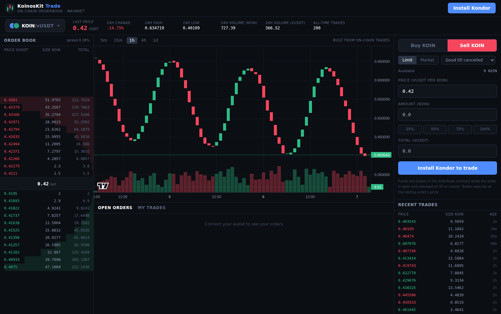

# KoinosKit Trade — on-chain orderbook DEX for Koinos

A full orderbook exchange for the Koinos blockchain, built for
**trade.koinoskit.site**. Unlike AMM DEXs (KoinDX), trading happens on a
central limit orderbook that lives entirely on chain: makers lock tokens in
the orderbook contract at their limit price, takers fill them straight from
their Kondor wallet, and a matching engine settles crossing orders with
price-time priority.



**Markets** — the curated launch set covers all pairs between five known
tokens, and listing is permissionless: anyone can add a new pair from the
app ("List a new pair" in the market selector) by picking listed tokens or
pasting any token contract address. The creator pays the (estimated,
mana-only) network cost. A pair that includes exactly one curated token is
always created with that token as the base, whichever way it was entered —
Token A + KOIN lists as KOIN/TOKENA under the KOIN tab. Pairs that don't
involve a curated token show up under the market selector's **Other** tab;
token metadata for new pairs is discovered on-chain, so the UI updates
without a rebuild.

The curated tokens:

| Market | Base | Quote |
| --- | --- | --- |
| KOIN/vUSDT | `19GYjDBVXU7keLbYvMLazsGQn3GTWHjHkK` | `12VoHz41a4HtfiyhTWbg9RXqGMRbYk6pXh` |
| KOIN/vUSDC | KOIN | `1N8iYrYEJdCVK1rhbqv3qZUzHcpoeKmFnj` |
| KOIN/vETH | KOIN | `1Tf1QKv3gVYLjq34yURSHw5ErTYbFjqTG` |
| VHP/KOIN | `12Y5vW6gk8GceH53YfRkRre2Rrcsgw7Naq` | KOIN |
| VHP/vUSDT | VHP | vUSDT |
| VHP/vUSDC | VHP | vUSDC |
| VHP/vETH | VHP | vETH |
| vETH/vUSDT | vETH | vUSDT |
| vETH/vUSDC | vETH | vUSDC |
| vUSDT/vUSDC | vUSDT | vUSDC |

## Repository layout

```
contract/   AssemblyScript smart contract (matching engine + escrow)
frontend/   React trading UI (Vite + Tailwind + lightweight-charts + koilib/kondor)
scripts/    Deployment & admin scripts (deploy, create markets, inspect state)
docs/       Screenshots and assets
```

## How it works

### The contract (`contract/`)

- `place_order(owner, marketId, side, price, quantity, flags)` — pulls the
  full escrow up front (quote tokens for buys, base tokens for sells) into
  the contract, then matches against the opposite side of the book, best
  price first, oldest first at equal price. Fills always execute at the
  **resting (maker) order's price**. Whatever remains is left on the book
  (GTC), refunded (IOC, used by the UI for market orders) or the call fails
  (post-only, if it would cross).
- `cancel_order(orderId)` — removes the order and refunds the remaining
  escrow. Only the order's owner can cancel.
- `create_market(baseToken, quoteToken, minBaseAmount)` — **permissionless**:
  anyone may list a new pair, paying the mana from their own transaction
  (the UI shows an estimate first). Both addresses must answer `decimals()`
  like a live token contract — which also rejects the retired system-locked
  KOIN/VHP contracts — duplicate pairs are rejected in either direction, and
  the minimum order size is capped at 1,000,000 whole base tokens. The app
  and scripts always list with the minimum at **one smallest unit** of the
  base token — there is no artificial minimum; the order-value-rounds-to-zero
  check below is the effective dust floor.
- `set_min_base_amount(marketId, minBaseAmount)` — admin only (signature of
  the contract account itself): repair hatch for a market created directly
  (not through the app) with an unusable minimum (`npm run set-min`).
- Read methods: `get_markets`, `get_orderbook`, `get_order`,
  `get_user_orders`, `get_trades` (per-market ring buffer of the last 2000
  trades — this is what the charts are built from).
- Events: `orderbook.market_created`, `orderbook.order_placed`,
  `orderbook.trade`, `orderbook.order_cancelled` with impacted addresses,
  so explorers and indexers pick trading activity up.

Prices are integers: **quote units per 1e8 base units** (`PRICE_SCALE`).
The frontend converts human prices (e.g. `0.42 vUSDT per KOIN`) using each
token's on-chain `decimals`.

Design properties worth knowing:

- **No admin custody**: the contract has no withdrawal/sweep method.
  Market creation is permissionless, and the admin key can only adjust a
  market's minimum order size — escrow can only ever flow back to traders
  through fills, cancels and refunds.
- Matching is capped at 20 fills per transaction (mana bound). A huge taker
  order that crosses more than 20 resting orders fills the first 20 and the
  remainder rests (or is refunded for IOC).
- Buy-order escrow is rounded up; any rounding dust is refunded when the
  order closes. Maker remainders too small to be worth 1 quote unit are
  closed and refunded instead of being traded for nothing.
- Markets are listed with the minimum order size at one smallest base unit,
  so there is no artificial minimum; remainders below a market's configured
  minimum (if any) are refunded rather than left as dust on the book.
- Zero trading fees in this version.
- Self-trading is not blocked: your taker order can fill your own resting
  order (tokens simply return to you).

### Tokens and authority

All five tokens (KOIN at `19GYjDBVXU7keLbYvMLazsGQn3GTWHjHkK`, VHP at
`12Y5vW6gk8GceH53YfRkRre2Rrcsgw7Naq` and the three v-tokens) are KCS-4
tokens with allowances, so the UI automatically bundles an exact-amount
`approve` operation in the same transaction before the contract pulls
escrow. Nothing to do manually — Kondor shows both operations in the
confirmation popup.

> ⚠️ The widely-cited `15DJN4a8SgrbGhhGksSBASiSYjGnMU8dGL` KOIN and
> `18tWNU7E4yuQzz7hMVpceb9ixmaWLVyQsr` VHP addresses are the **retired
> pre-migration contracts**: their storage is system-locked and any call
> to them fails with "user code cannot access system space". Always use
> the live addresses above.

### The frontend (`frontend/`)

Vite + React + TypeScript + Tailwind. Kondor for signing, `koilib` for
everything chain-side, `lightweight-charts` for candlesticks. All amounts
are handled as `BigInt` in the tokens' smallest units.

- Market selector with last price for all pairs, token tabs (plus "Other"
  for pairs of non-curated tokens) and a "List a new pair" flow: pick or
  paste both token addresses (live-probed for symbol/decimals), see the
  estimated mana cost vs your available mana, and sign with Kondor — the
  new pair appears for everyone without a frontend rebuild, token metadata
  is discovered from the chain. When exactly one side is a curated token,
  the pair is auto-ordered with it as the base (KOIN/TOKENA, never
  TOKENA/KOIN)
- Candlestick + volume chart (5m/15m/1h/4h/1d) built client-side from the
  contract's on-chain trade history, polled every 4 s
- Orderbook with price-level aggregation, depth bars and click-to-fill
- Buy/sell panel: limit orders (GTC / IOC / post-only) and market orders
  (implemented as IOC limit orders with 1% price protection computed from
  the live book), balance percentage buttons, escrow preview
- Open orders (cancel from the table) and personal fill history
- 24h stats (change, high/low, volumes) computed from on-chain trades
- Transaction toasts with links to koinosblocks.com

## Deployment guide

### 0. Prerequisites

- Node.js 20+ (22 recommended) — npm is enough, Yarn is optional
- A little KOIN for mana on the deploying account

> **Windows users:** the commands below are written for bash. Windows
> PowerShell 5.1 does not understand `&&` between commands, and the
> `NAME=value command` env-var prefix is bash-only. Run each command on
> its own line and set environment variables with `$env:` — the full
> PowerShell sequence is in
> [Windows (PowerShell) quick reference](#windows-powershell-quick-reference)
> below.

### 1. Build the contract

```bash
cd contract
npm install
npm run build         # produces build/release/contract.wasm + abi/
```

(The build pins the `asconfig.json` output for AssemblyScript 0.27 and
retries the protoc codegen steps, which are flaky on some systems.)

### 2. Create the contract account & deploy

```bash
cd ../scripts
npm install
npm run generate-key                  # prints a fresh address + WIF
# send ~1 KOIN to the printed address for mana, then:
KOINOS_WIF=<wif> npm run deploy
KOINOS_WIF=<wif> npm run create-markets
ORDERBOOK_ADDRESS=<address> npm run show-state   # sanity check
```

> **The generated key is the contract.** The address becomes the DEX
> contract id and the key is the admin key for `set_min_base_amount`.
> Store the WIF offline; do not reuse a personal wallet key. The key
> cannot touch escrowed funds, but treat it carefully anyway — it can
> upload new bytecode over the contract.

**Upgrading an existing deployment**: re-running `npm run deploy` with the
same WIF uploads the new bytecode (and registers the updated ABI) over the
existing contract address. All state — markets, open orders, escrow, trade
history — is preserved; only the code changes. Re-uploading costs far less
mana than the script's worst-case estimate suggests (set `FORCE=1` to skip
the preflight check).

To use the Harbinger testnet first (recommended dry run):
`KOINOS_NETWORK=harbinger`, fund the account from the faucet
(https://faucet.koinos.io), set `HARBINGER_*` token addresses in
`scripts/config.js` (deploy your own test tokens or reuse existing ones)
and repeat the steps.

### 3. Configure & build the frontend

```bash
cd ../frontend
npm install
cp .env.example .env        # set VITE_ORDERBOOK_ADDRESS=<address>
npm run dev                 # local development
npm run build               # production build in dist/
```

### 4. Host at trade.koinoskit.site

`npm run build` produces a **fully static site** in `frontend/dist/` —
plain HTML/JS/CSS with no server-side code. The browser talks to the
Koinos RPC directly, so any static file host works. Two important rules:

- The contract address is **baked in at build time**: `.env` (or the
  build environment) must contain `VITE_ORDERBOOK_ADDRESS` *before*
  running `npm run build`. Changing it later means rebuilding and
  re-uploading.
- Serve the site over **HTTPS** (wallet extensions and clipboard APIs
  behave best on secure origins).

#### Hostinger — automatic deploy (recommended)

The repo ships `.github/workflows/deploy-hostinger.yml`, which builds the
site and uploads it over FTP on every push to the frontend. Set it up once
and you never touch File Manager again:

1. In hPanel go to **Files → FTP Accounts** and note the **FTP hostname**,
   **username**, and **password** (create an FTP account if there isn't
   one). Also note the web root path — usually `public_html`.
2. In GitHub: **repo Settings → Secrets and variables → Actions → Secrets**,
   add three repository secrets:
   - `FTP_SERVER` — a **bare hostname or IP**, e.g. `82.29.123.45` or
     `ftp.koinoskit.site`. NO `ftp://` scheme, no path, no slash. Using
     `ftp://…` causes `getaddrinfo ENOTFOUND`.
   - `FTP_USERNAME`
   - `FTP_PASSWORD`
3. (Optional) On the **Variables** tab add `FTP_SERVER_DIR` if your web
   root is not `./public_html/`, and `ORDERBOOK_ADDRESS` to change the
   contract the build points at.
4. Push any change under `frontend/`, or run the workflow manually from the
   **Actions** tab. It builds and uploads `frontend/dist` for you.

#### Hostinger — manual upload (fallback)

1. In hPanel create the subdomain / confirm the domain's web root.
2. Build locally: `cd frontend`, set `.env`, `npm run build`.
3. Upload the **contents** of `frontend/dist/` (index.html, `assets/`,
   favicon.svg) into the web root — `index.html` must sit directly in the
   web root, not inside a `dist` folder.
4. Enable the free SSL certificate in hPanel.

No Node.js hosting, `.htaccess` rules or database are needed — the app is
a single page with no server routes. The hashed asset filenames make
caching safe across updates.

#### GitHub Pages (optional alternative)

`.github/workflows/deploy.yml` can deploy to GitHub Pages instead. It is
manual-only: enable **Settings → Pages → Source: GitHub Actions**, add an
`ORDERBOOK_ADDRESS` repository variable, and run the workflow from the
Actions tab. Cloudflare Pages / Netlify also work — set the same
`VITE_*` variables at build time.

### Windows (PowerShell) quick reference

Everything works on Windows; only the shell syntax differs. From the
folder where you cloned the repository:

```powershell
# 1. build the contract
cd contract
npm install
npm run build

# 2. create the contract account
cd ..\scripts
npm install
npm run generate-key

# send ~1 KOIN to the printed address for mana, then deploy.
# $env: variables persist for the rest of the PowerShell session.
$env:KOINOS_WIF = "paste the WIF here"
npm run deploy
npm run create-markets

# sanity check
$env:ORDERBOOK_ADDRESS = "paste the contract address here"
npm run show-state

# 3. frontend
cd ..\frontend
npm install
Copy-Item .env.example .env
# edit .env and set VITE_ORDERBOOK_ADDRESS, then:
npm run dev        # local development at http://localhost:5173
npm run build      # production build in dist/
```

When you are done, clear the key from the session with
`Remove-Item Env:KOINOS_WIF` (closing the terminal also discards it).

### Updating the contract ABI

If you change `contract/assembly/proto/orderbook.proto`, rebuild the
contract and re-sync the frontend copy:

```bash
cd contract && npm run build
cd ../frontend && npm run sync-abi
```

## Development notes

- `contract/` uses `@koinos/sdk-as` 1.4.0 (AssemblyScript 0.27). Storage
  spaces: markets, orders by id, book index (market+side+price+seq for
  price-time iteration), per-user order index, trade ring buffers.
- `koilib` must resolve `protobufjs@7.4.0` — newer protobufjs releases
  break koilib's descriptor loading, which is why both `frontend/` and
  `scripts/` pin it via `overrides`.
- The generated koilib ABI (`orderbook-abi.json`) uses camelCase field
  names (`marketId`, `minBaseAmount`, …) — that's what all koilib
  calls/results use.
- Known limitations: charts only reach as far back as the on-chain trade
  ring buffer (2000 trades per market); order history beyond open orders
  and recent fills needs an off-chain indexer; no trading fees switch yet.

## Security status

The contract compiles and its economics are reviewed (escrow conservation,
rounding, price-time priority, authority checks), but it has **not been
audited or battle-tested on mainnet**. Do a Harbinger dry run, start with
small minimum markets, and consider an audit before promoting the site
widely.
